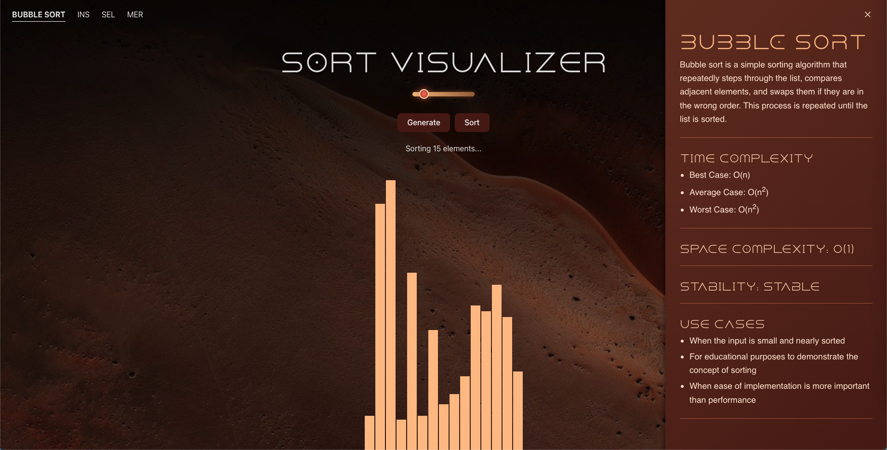

# SortVisualizer

Welcome to **SortVisualizer**, an interactive web app that brings sorting algorithms to life with a **Dune-inspired theme**! Whether you're a coding newbie, an algorithm aficionado, or just curious about how data gets sorted, this project is here to add a bit of color, sound, and desert vibes to your learning journey.

## Features
- **Interactive Sorting Visualizations**: Watch how Bubble Sort, Insertion Sort, Selection Sort, and Merge Sort work in real time.
- **Dynamic Bar Heights**: The bar heights adapt perfectly to the container for an aesthetically pleasing view.
- **Dune-Inspired Design**: Immerse yourself in a futuristic desert atmosphere with earthy tones, sleek animations, and a sci-fi aesthetic.
- **Sound Effects**: Enjoy audio feedback for comparisons and swaps, blending tech with the mystique of Dune.
- **Customizable Input**: Generate arrays of various sizes and observe how different algorithms handle the data.
- **Info Tab**: Learn about each algorithm with an easy-to-read tab offering explanations, time complexities, and use cases.

## Technologies Used
- **React.js**: Building the interactive UI.
- **CSS**: Styling the visualizer and animations, including Dune-themed elements.
- **JavaScript**: Implementing sorting algorithms and dynamic rendering.
- **HTML5 Audio**: Adding sound effects to enhance the experience.

## How It Works
1. **Choose an Array Size**: Use the slider to select the number of elements.
2. **Generate Array**: Click the "Generate" button to create a random array.
3. **Pick an Algorithm**: Select Bubble Sort, Insertion Sort, or Selection Sort.
4. **Explore the Info Tab**: Click on the Info Tab to learn more about the selected algorithm, including step-by-step explanations and complexities.
5. **Watch the Magic**: Enjoy the animations, gradients, and sounds as the algorithm sorts the array!

## Info Tab Details
The **Info Tab** provides:
- **Algorithm Overview**: A concise description of how the algorithm works.
- **Time Complexity**: Best, average, and worst-case scenarios.
- **Space Complexity**: Memory requirements for the algorithm.
- **Use Cases**: Scenarios where the algorithm shines.
- **Interactive Steps** (optional): A step-by-step guide to help you understand the sorting process visually.

## The Dune Theme
Inspired by the world of **Dune**, the theme includes:
- A desert-inspired color palette with deep oranges, sandy yellows, and muted blues.
- Gradient effects mimicking desert horizons.
- Subtle, sci-fi-inspired animations for transitions and interactions.

## Future Enhancements
- Add more sorting algorithms.
- Cuztomizable array: almost sorted, random, etc.
